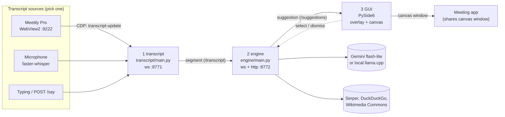
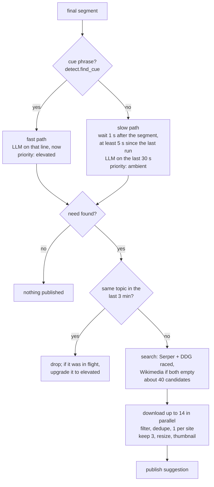
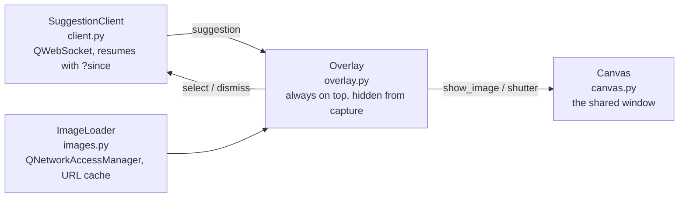
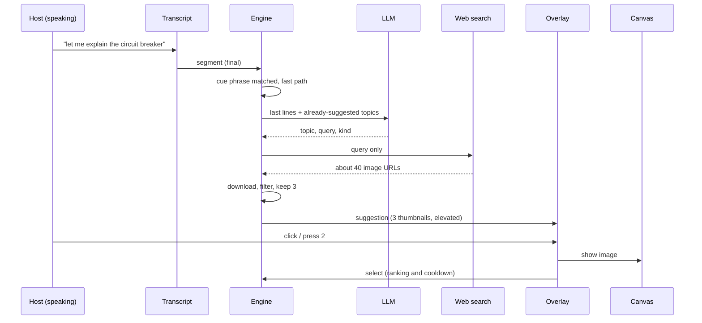

# Live Co-pilot: architecture overview

While the host talks, the co-pilot notices when a picture would help, finds a few images, and offers them in a host-only overlay. One click puts an image on a canvas window that is already shared in the meeting. This page is the map; usage lives in the READMEs it links to.

## Components

Three local processes joined by two WebSocket streams. Everything binds to `127.0.0.1`, and the only thing that ever leaves the machine is an image-search keyword (plus the LLM prompt, see [decisions](#decisions-and-fallbacks)).



| Part | Code | Owner | Port | Role |
| --- | --- | --- | --- | --- |
| Transcript | [`transcript/main.py`](transcript/main.py) | Hari | ws `8771` | Turns speech into `segment` messages |
| Engine | [`engine/`](engine/) | Shreevardhan | ws + http `8772` | Decides when a picture helps, finds and filters images, publishes `suggestion` |
| GUI | [`gui/`](gui/) | Mahreen | none (client) | Overlay for the host, canvas to share |
| Contract | [`contracts/`](contracts/) | everyone | | Message dataclasses, ports, `StreamServer` / `Subscriber` |
| Mocks, tests | [`mocks/`](mocks/), [`tests/`](tests/) | everyone | | Fake upstream/downstream so each part runs alone; offline tests |

`engine.console` (dev UI on `:8770`) and the engine's `/events` stream are tooling, not part of the contract.

## The contract in one paragraph

Every stream is a WebSocket plus a `/history` endpoint, served by the shared `StreamServer`. Each message gets an increasing `seq`; a client remembers the last one and reconnects with `?since=<seq>` to replay what it missed. If `since` is higher than the server's counter the server restarted, so the client gets a fresh start. Unknown fields are ignored. Full spec: [contracts/README.md](contracts/README.md).

## Part 1: transcript sources

`transcript/main.py` publishes one stream whatever the source. With no flag it checks `http://127.0.0.1:9222/json`:

| Source | When | How |
| --- | --- | --- |
| Meetily Pro bridge | Meetily started with `--remote-debugging-port=9222` | Attaches to Meetily's WebView2 over the Chrome DevTools Protocol, hooks the Tauri `transcript-update` event, and polls a JS queue every 150 ms. Partials arrive with `final: false` |
| Microphone | Meetily not detected | `faster-whisper` `base.en` int8 on CPU, 3 s chunks with 0.5 s overlap, a silence gate, and a filter for Whisper's stock hallucinations ("you", "thank you.") |
| Typing / HTTP | `--typing`, or `POST /transcript/say` | Each line becomes a final segment, for demos and the engine console |

The bridge exists because Meetily's Agent API refuses transcript reads mid-recording (`409 recording_in_progress`); see [docs/tech/copilot-live-transcript.md](../../docs/tech/copilot-live-transcript.md).

## Part 2: engine

The engine only reads **final** segments. Each one takes a fast path or a slow path, and both end in the same search-and-publish stage.



| Module | Responsibility |
| --- | --- |
| [`detect.py`](engine/detect.py) | Cue phrases, the LLM prompt, a no-LLM heuristic fallback |
| [`llm.py`](engine/llm.py) | Gemini model chain, then local llama.cpp; a failing backend is paused rather than retried per call |
| [`search.py`](engine/search.py) | Provider functions and ordering; sends only the query |
| [`fetch.py`](engine/fetch.py) | Download, reject banners, tiny, blank, stock-watermark and duplicate images; save JPEG + thumbnail |
| [`main.py`](engine/main.py) | `Engine`: topic cooldown, `pending` upgrades, feedback handling, `.cache/engine_log.jsonl`, server wiring |

`select` is logged; `dismiss` blocks that topic for 3 more minutes. Details: [engine/README.md](engine/README.md).

## Part 3: GUI

One PySide6 process, two top-level windows.



- **Overlay** shows one card per suggestion (`ambient` is faint, `elevated` is full strength with a glow, expiry after `expires_in` unless hovered), a history reel, keys (`1/2/3`, Space, arrows, `B`/Esc shutter) and paste/drop to stage a local image. It collapses to a pill when idle.
- **Canvas** is a plain window with a crossfade and a panic shutter. It is the only thing the audience sees.
- **Hidden from capture:** `app.exclude_from_capture` calls `SetWindowDisplayAffinity(WDA_EXCLUDEFROMCAPTURE)` on the overlay, so sharing the whole screen doesn't expose it. Images are always loaded over HTTP from the engine, never from disk.
- **Resume:** `SuggestionClient` stores the last `seq` in `QSettings` and checks `/suggestions/history` first, so an engine restart resets it instead of waiting for a `seq` that will never come.

## One suggestion, end to end



Typical latency from speech to suggestion is 5 to 7 s: LLM about 1 s, search about 1.8 s, downloads 2 to 2.5 s.

## Decisions and fallbacks

| Decision | Why | If it fails |
| --- | --- | --- |
| Bridge into Meetily's WebView2 instead of its Agent API | The API returns `409 recording_in_progress` during a recording | Falls back to the microphone, then typing |
| Contract-first with mocks for every part | Three people building in parallel without waiting on each other | `run_all.ps1 -MockTranscript` / `-MockEngine` swap in a fake |
| Cue phrases for the fast path, LLM for the slow path | Explicit cues ("picture a…") deserve an immediate, attention-grabbing suggestion; the rest can be quiet | LLM error: `detect.heuristic` uses the words after the cue |
| Gemini flash-lite first, local llama.cpp second | About 1 s per call; the 3.5/3.8 flash models take 15 s+ | Rate-limited backends are paused; with no key, local only |
| Several search providers raced, 1 image per site, stock sites excluded | Quality and speed; watermarked stock images look bad on a shared canvas | Wikimedia Commons (keyless) when both others are empty; if nothing passes the filter, rejected candidates are used |
| Engine serves the images over HTTP | The GUI stack stays free of file paths and the contract stays simple | |
| Canvas is a separate window, overlay is excluded from capture | The host shares one window for the whole meeting and never switches | Panic shutter blanks the canvas instantly |
| Everything on loopback | Privacy: the transcript never leaves the machine | Only the search keyword and the LLM prompt go out |

## Run it

```powershell
.\run_all.ps1                   # real transcript + engine + GUI, each in its own window
.\run_all.ps1 -MockTranscript   # scripted talk instead of the live source
.\run_all.ps1 -MockEngine       # scripted suggestions, for GUI work
python -m engine.console        # dev UI: every engine decision and candidate image
python -m pytest -q tests       # offline tests
```

## See also

- [README.md](README.md): setup and working on one part alone
- [contracts/README.md](contracts/README.md): message formats
- [engine/README.md](engine/README.md), [gui/README.md](gui/README.md), [transcript/README.md](transcript/README.md)
- [docs/tech/copilot-live-transcript.md](../../docs/tech/copilot-live-transcript.md): why the transcript source was blocked and the options considered
- [../extraction-test/ARCHITECTURE.md](../extraction-test/ARCHITECTURE.md): the other half of the project
