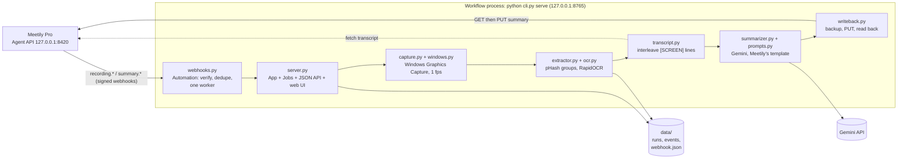
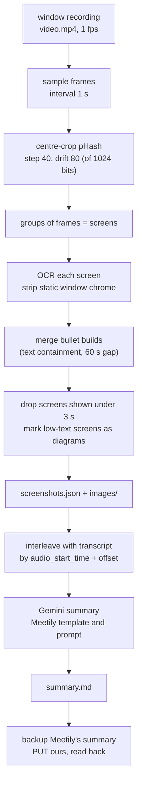
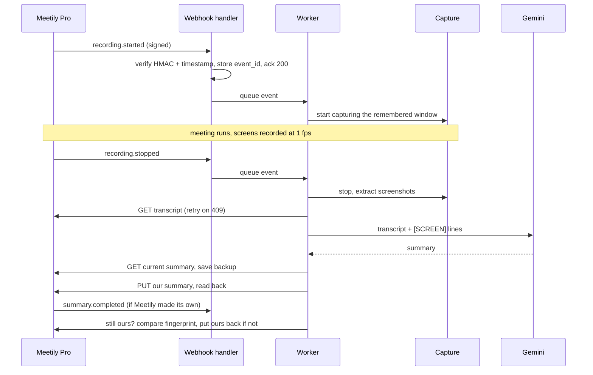

# Visual Context Summary: architecture overview

A Meetily workflow. While a meeting is recorded it watches one window (the slides, a shared screen, a lecture), keeps the distinct screens, reads them with local OCR, interleaves them with the transcript, and writes a better summary back into Meetily. This page is the map; commands and options live in [README.md](README.md).

## Components



| Module | Responsibility |
| --- | --- |
| [`cli.py`](cli.py) | Entry point: `extract`, `summarize`, `publish`, `windows`, `capture`, `serve` |
| [`vcs/meetily_client.py`](vcs/meetily_client.py) | Stdlib client for the Agent API; the read-only loopback token for reads, `MEETILY_PRO_TOKEN` only for writes |
| [`vcs/windows.py`](vcs/windows.py) | List capturable windows, thumbnails via `PrintWindow` (works for covered windows) |
| [`vcs/capture.py`](vcs/capture.py) | `WindowRecorder`: records one window to a steady 1 fps video |
| [`vcs/extractor.py`](vcs/extractor.py) | Video to distinct screenshots (`screenshots.json` + images) |
| [`vcs/ocr.py`](vcs/ocr.py) | Local RapidOCR on CPU; drops lines made only of meeting-app chrome words |
| [`vcs/transcript.py`](vcs/transcript.py) | `[MM:SS]` transcript lines with `[SCREEN]` lines at each screenshot's start time |
| [`vcs/prompts.py`](vcs/prompts.py) | Meetily's final-report prompt and Standard template (verbatim), plus our screen-context rules |
| [`vcs/summarizer.py`](vcs/summarizer.py) | Gemini call with retries, model fallback, Meetily-style spacing |
| [`vcs/writeback.py`](vcs/writeback.py) | Write our summary into Meetily after backing up what is there |
| [`vcs/webhooks.py`](vcs/webhooks.py) | Subscription, HMAC verification, event store, the worker that runs the workflow |
| [`vcs/server.py`](vcs/server.py) | `App` (settings, runs, capture, jobs), loopback HTTP API, serves [`vcs/web/`](vcs/web/) |
| [`vcs/speaker_names.py`](vcs/speaker_names.py) | Speaker names the user enters, since the API only gives cluster ids |
| [`manifest.yaml`](manifest.yaml) | The meetily-workflows catalog entry (scopes `read`, `write`) |

## The pipeline

Each stage reads and writes plain files in `data/<run>/`, so any step can be run alone from the CLI.



Extraction is adapted from lecture-to-notes (MIT): interval sampling, centre-crop pHash with two thresholds, text-containment merging. We kept start **and** end times per screen and left out layout (SSIM) merging, because a wrong merge silently deletes content.

## The automated flow

`python cli.py serve` also subscribes to Meetily's events. The HTTP handler only acknowledges (Meetily allows 5 s); a single worker thread does the work, in delivery order.



| Event | Action |
| --- | --- |
| `recording.started` | Start capturing the window picked last time (Settings: auto capture) |
| `recording.stopped` | Stop, extract, wait for the transcript, summarise, back up, `PUT` (Settings: auto write-back) |
| `recording.failed` / `error` / `stop_failed` | Stop and keep the screenshots; no summary |
| `summary.completed` / `summary.failed` | If Meetily replaced ours, put ours back; if ours wasn't written yet, write it now |

The workflow follows the catalog's pattern: **Subscribe** (one webhook, secret kept in `data/webhook.json`) then **Verify** (`X-Meetily-Signature` HMAC-SHA256 over `"{timestamp}.{body}"`, plus a 5-minute window) then **Deduplicate** (`event_id` persisted in `data/events/` before the ack) then **Fetch** (payloads are thin) then **Act**.

## Decisions and fallbacks

| Decision | Why | If it fails |
| --- | --- | --- |
| Write our summary on `recording.stopped`, not `summary.completed` | Meetily only sends `summary.completed` when it makes its own summary, and hands-off recordings never got one (live test, Oct 2) | The summary events act as a guard: a content fingerprint says whether Meetily still shows ours, because it reformats the Markdown |
| Back up before every `PUT` | `PUT` overwrites with no undo | Backup fails or Meetily is still generating: nothing is written |
| Windows Graphics Capture, one window | Records the chosen window even when covered, no cursor | A writer thread saves the latest frame every second, because WGC only delivers frames on change; video time then equals wall-clock time |
| Load OCR at startup | Loading onnxruntime after a capture session crashes the next capture natively (`ocr.warm_up`) | |
| Local OCR; Gemini only for the summary | Capture and OCR stay on the machine. Gemini gets the transcript with OCR text, plus the images of diagram-like screens (decided Oct 2) | Gemini overloaded: one retry, then `GEMINI_FALLBACK_MODEL` |
| Meetily's own prompt and template | The result should read like a Meetily summary and drop in unchanged | |
| Speaker names entered in our UI | The API exposes diarization cluster ids, not the names set in the app | Lines are labelled `Speaker 9:` |
| Loopback only, `X-VCS` header on writes | A web page on another origin can't drive the local server | Secrets stay in environment variables or a gitignored `.env`, never sent to the browser |
| Park events when Meetily is offline | Webhooks can arrive while it restarts | `offline` events are re-queued when Meetily is back; unfinished events resume after a restart |

## Data on disk

```text
data/
  webhook.json              subscription id + hmac_secret (shown once by Meetily)
  settings.json             model, extraction thresholds, auto capture / write-back, keep capture video, watched window
  events/<event_id>.json    every accepted event, status and log
  speakers/<meeting>.json   speaker names
  <run>/                    meta.json, screenshots.json, images/, summary.md, published.json, backups/
```

## See also

- [README.md](README.md): setup and every command
- [docs/tech/summary-pipeline.md](../../docs/tech/summary-pipeline.md): product goals and open decisions
- [docs/tech/screen-capture.md](../../docs/tech/screen-capture.md): capture and selection design
- [docs/tech/meetily-api-findings.md](../../docs/tech/meetily-api-findings.md) and [meetily-summary-prompts.md](../../docs/tech/meetily-summary-prompts.md)
- [../copilot/ARCHITECTURE.md](../copilot/ARCHITECTURE.md): the live co-pilot half of the project
