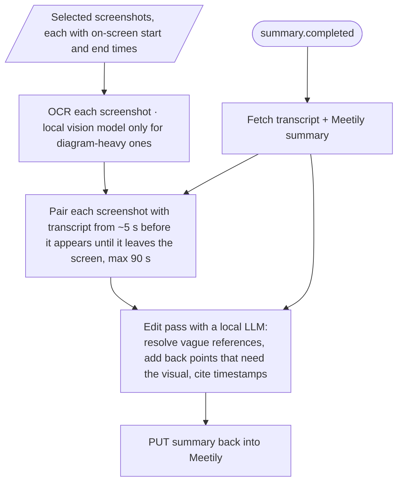

# Visual Context Summary: Pipeline (Oct 2)

## What we want (product view)

- **Reader:** someone who **missed the meeting**.
- **Goal:** they read the summary and never wonder "what was on screen?". **Text-only is fine.** The summary must pass the *clipboard test* (understandable pasted into Slack/email with no images).
- **Shape:** visual context **woven into** the summary, not a separate slide dump.
- **Vague references** ("as you can see here", "this one went up") get **resolved** into facts.
- **Slide content the speaker never discussed** is left out.
- **User effort:** pick the window to watch **once**, then hands-off.

## Key insight (why we don't just edit Meetily's summary)

Meetily summarises **without seeing the screen**, so moments like "and this jumped 40% after the redesign" look meaningless and get **dropped**. An edit pass that only sees Meetily's summary can't bring them back.
→ For each screenshot, the edit pass also gets the **transcript around it**, so it can recover dropped points.

## Pipeline (starts after the meeting ends)

Screenshot capture and selection are covered in [screen-capture.md](screen-capture.md) and appear here as one input.

- **Transcript window:** from ~5 s *before* the screenshot appears (people introduce a slide just before switching) until it leaves the screen; long slides capped at ~90 s.
- **Edit pass instruction:** "Here's the summary. Here's what was shown and said at each moment. Fix vague references and **add back any point that only makes sense with the visual**, citing its timestamp."
- **Write-back:** `PUT /v1/meetings/{id}/summary` (`write` scope). Keep a copy of Meetily's original first (no undo); also useful for a before/after demo.

## The big open decision: build on Meetily's summary, or write our own?

| | **A. Build on Meetily's summary** (current default) | **B. Our own summarizer** |
| --- | --- | --- |
| Input to final LLM call | Meetily summary + (screenshot OCR + transcript window) per screenshot | Full transcript with `[SCREEN]` lines interleaved by timestamp |
| Cost | Small: summary + short windows | Re-reads the whole transcript (the expensive part), and Meetily's summary runs anyway unless disabled |
| Quality risk | A small local model may do the "what was dropped?" judgement badly | A small local model's from-scratch summary may look worse than Meetily's |
| Control | Less | Full |
| Judge story | "Meetily summarises what was **said**; we add what was **shown**" (extends their product) | "We replaced their summarizer" (allowed, but competes with it) |

**Plan:** both share ~90% of the pipeline (capture, dedup, OCR, alignment). Build that first, then **A/B the final step on the same recorded meeting** and decide on evidence. Default to A unless B is clearly better with the same model.

## Open questions

- **Which model runs the final step?** Local (Ollama) or a cloud model with the user's own key. This changes the A/B more than anything.
- **Edit-pass budget:** cap the number of added points ("only add one if a reader would be confused without it"), or be thorough?
- **Screenshots after the summary is written:** delete (text only survives) or keep so readers can open the original?
- **Privacy:** beyond "watched window only", what else? (Not settled.)
- **Does Meetily Pro bundle a model (e.g. Claude) for summaries?** Unverified; check before using it as an argument.
